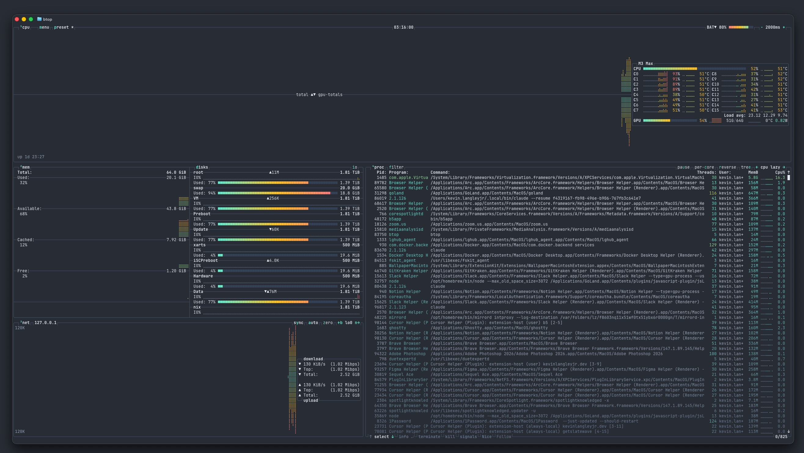

<div align="center">


<picture>
  <source media="(prefers-color-scheme: dark)" srcset="https://getslatewave.com/brand/wordmark-light.png">
  
</picture>

# Slatewave (btop)

A Slatewave `.theme` for [btop](https://github.com/aristocratos/btop) — the resource monitor with the prettiest dashboard in the terminal. Part of the [Slatewave family](#slatewave-family) — one palette across editors, terminals, prompts, notes, and more.

> _Slate below, teal above._



</div>

---

## What it styles

btop reads `.theme` files from `~/.config/btop/themes` and uses them to color every panel, meter, and graph it draws. This theme maps the full set of theme keys onto the family palette so the dashboard reads with the same vocabulary as the editor and terminal ports.

| File | Purpose |
|---|---|
| `slatewave.theme` | The palette — drop into btop's user themes directory and select via `color_theme` |

Highlights:

- **One ramp for every meter and graph** — `temp`, `cpu`, `mem`, `net`, and the process activity column all use **teal-300 → amber-400 → rose-400**. Read it as: more rose = more activity.
- **Slate-600 chrome** — every box outline (`cpu_box`, `mem_box`, `net_box`, `proc_box`, `div_line`) uses the same slate-600, so the four panels read as a single coherent grid rather than four separate widgets.
- **Teal accents** — panel labels (`¹cpu`, `²mem`, `³proc`), keyboard shortcuts (`hi_fg`), and the `proc_misc` color all use teal-300, matching the focus ring in every editor port.
- **Slate-700 / teal-300 selection** — the active row in the process list highlights slate-700 + teal-300, mirroring the `list.activeSelectionBackground` / `list.activeSelectionForeground` pair from the VSCode port.
- **Transparent by default** — `main_bg = ""` so btop inherits the terminal background. Pair with any of the Slatewave terminal ports for matched chrome, or set `theme_background = false` in `btop.conf` for a fully transparent dashboard.

---

## Requirements

- **btop** ≥ 1.2 — [install guide](https://github.com/aristocratos/btop#installation). Earlier versions of btop are missing some of the theme keys this file sets (`process_*`, `graph_text`, `meter_bg`).
- A **24-bit / true-color terminal**. Set `truecolor = true` in `~/.config/btop/btop.conf` (the default). At 256 colors, the teal/amber/rose ramp collapses and the gradient meters lose their middle stop.

---

## Installation

### Drop the theme into btop's themes dir

```sh
mkdir -p ~/.config/btop/themes
curl -fsSL https://raw.githubusercontent.com/kevinlangleyjr/btop-slatewave/main/slatewave.theme \
  -o ~/.config/btop/themes/slatewave.theme
```

### Or: clone the repo and symlink

If you'd rather track updates with git, clone the repo and symlink the theme file in. btop only scans the top level of its themes directory, so the symlink (rather than putting the clone *inside* `themes/`) is the path of least resistance.

```sh
git clone https://github.com/kevinlangleyjr/btop-slatewave.git ~/.config/btop/btop-slatewave
ln -sf ~/.config/btop/btop-slatewave/slatewave.theme \
  ~/.config/btop/themes/slatewave.theme

# Pull updates with: git -C ~/.config/btop/btop-slatewave pull
```

### Activate the theme

Either edit `~/.config/btop/btop.conf` directly:

```ini
color_theme = "slatewave"
```

Or do it in one shot from the command line:

```sh
sed -i.bak 's/^color_theme = .*/color_theme = "slatewave"/' ~/.config/btop/btop.conf
```

Or interactively — launch btop, press `Esc` → **Options** → arrow over to `color_theme` and pick `slatewave` from the list.

### Verify

```sh
btop
```

You should see:

- `¹cpu`, `²mem`, `³proc` panel labels in teal-300, sitting on slate-600 box outlines
- Every meter and graph filled with the same teal → amber → rose gradient
- The currently-selected process row highlighted in slate-700 + teal-300
- Keyboard shortcuts in the top/bottom bars in slate-300, with their hotkey letters in teal-300

---

## Palette

The same palette as the rest of the Slatewave family. Every color resolves to a semantic role, so the dashboard's reading is consistent with the editors and terminals.

### Foundation — slate

| | Hex | Tailwind | Where |
|---|---|---|---|
|  | `#1e293b` | slate-800 | optional opaque panel bg (set `main_bg` to use) |
|  | `#334155` | slate-700 | `selected_bg`, `meter_bg` (meter track) |
|  | `#475569` | slate-600 | every box outline + `div_line` |
|  | `#64748b` | slate-500 | `inactive_fg` |
|  | `#94a3b8` | slate-400 | `graph_text` (overlay readouts on graphs) |
|  | `#cbd5e1` | slate-300 | tab labels, secondary text |
|  | `#e2e8f0` | slate-200 | `main_fg`, `title` (default text) |

### Signature — teal · accents — amber, rose

| | Hex | Tailwind | Role |
|---|---|---|---|
|  | `#5eead4` | teal-300 | `hi_fg`, `proc_misc`, `selected_fg`, panel labels, **gradient start** |
|  | `#fbbf24` | amber-400 | **gradient mid** — middle of every meter/graph ramp |
|  | `#fb7185` | rose-400 | **gradient end** — top of every meter/graph ramp |

---

## Theme key mapping

Every key in `slatewave.theme` and what it controls:

| Key | Color | Semantic role |
|---|---|---|
| `main_bg` | `""` (empty) | Panel background — empty for terminal transparency. Set to `#1e293b` for opaque slate panels. |
| `main_fg` | `#e2e8f0` | Default text color across all panels |
| `title` | `#e2e8f0` | Box / panel title text |
| `hi_fg` | `#5eead4` | Highlight color for keyboard shortcut letters |
| `selected_bg` | `#334155` | Selected process row background |
| `selected_fg` | `#5eead4` | Selected process row foreground |
| `inactive_fg` | `#64748b` | Disabled / inactive text |
| `graph_text` | `#94a3b8` | Readout values overlaid on graphs |
| `meter_bg` | `#334155` | Unfilled portion of meters |
| `proc_misc` | `#5eead4` | Mini cpu graphs in process box, details memory graph, status text |
| `cpu_box`, `mem_box`, `net_box`, `proc_box` | `#475569` | All four box outlines (kept identical for grid coherence) |
| `div_line` | `#475569` | Divider lines between sub-panels |
| `temp_*`, `cpu_*`, `free_*`, `cached_*`, `available_*`, `used_*`, `download_*`, `upload_*`, `process_*` | `#5eead4` → `#fbbf24` → `#fb7185` | Every gradient ramp uses the same three stops |

---

## Customize

btop's themes are plain key/value files — fork and edit. The two changes most people make:

### Opaque slate panels instead of transparent

Edit `slatewave.theme` and set:

```ini
theme[main_bg]="#1e293b"
```

Then make sure `theme_background = true` in `btop.conf` so btop actually fills the background.

### Inverse ramps for "free" meters

This theme uses the same teal → rose ramp on every meter, including `free_*` and `available_*`, so the meter color tracks the *fill level* rather than the *semantic*. If you'd rather have "more free = more teal" (good = teal, bad = rose), swap the start and end on those keys:

```ini
theme[free_start]="#fb7185"
theme[free_mid]="#fbbf24"
theme[free_end]="#5eead4"

theme[available_start]="#fb7185"
theme[available_mid]="#fbbf24"
theme[available_end]="#5eead4"
```

After editing, restart btop (`Esc` → **Quit** → relaunch) — it caches theme parses on launch.

---

## Slatewave family

One palette. Every tool.

- **Editors** — [VSCode](https://github.com/kevinlangleyjr/vscode-slatewave) · [Neovim](https://github.com/kevinlangleyjr/neovim-slatewave) · [Helix](https://github.com/kevinlangleyjr/helix-slatewave) · [Zed](https://github.com/kevinlangleyjr/zed-slatewave) · [Sublime Text](https://github.com/kevinlangleyjr/sublime-text-slatewave) · [JetBrains](https://github.com/kevinlangleyjr/jetbrains-slatewave)
- **Terminals** — [Alacritty](https://github.com/kevinlangleyjr/alacritty-slatewave) · [Ghostty](https://github.com/kevinlangleyjr/ghostty-slatewave) · [iTerm2](https://github.com/kevinlangleyjr/iterm2-slatewave) · [WezTerm](https://github.com/kevinlangleyjr/wezterm-slatewave) · [Windows Terminal](https://github.com/kevinlangleyjr/windows-terminal-slatewave) · [Kitty](https://github.com/kevinlangleyjr/kitty-slatewave)
- **Prompts** — [Oh My Posh](https://github.com/kevinlangleyjr/slatewave-omp) · [Starship](https://github.com/kevinlangleyjr/starship-slatewave)
- **Multiplexer** — [tmux](https://github.com/kevinlangleyjr/tmux-slatewave)
- **CLI** — [bat](https://github.com/kevinlangleyjr/bat-slatewave) · [delta](https://github.com/kevinlangleyjr/delta-slatewave) · [LSD](https://github.com/kevinlangleyjr/lsd-slatewave)
- **Notes** — [Obsidian](https://github.com/kevinlangleyjr/obsidian-slatewave) · [Logseq](https://github.com/kevinlangleyjr/logseq-slatewave) · [MarkEdit](https://github.com/kevinlangleyjr/markedit-slatewave) · [Anytype](https://github.com/kevinlangleyjr/anytype-slatewave)
- **Launchers** — [Alfred](https://github.com/kevinlangleyjr/alfred-slatewave) · [Raycast](https://github.com/kevinlangleyjr/raycast-slatewave)
- **Chat** — [Slack](https://github.com/kevinlangleyjr/slack-slatewave)

See [getslatewave.com](https://getslatewave.com) for the full family.

---

## Contributing

Issues and PRs welcome. For palette tweaks, please include a before/after screenshot of `btop` against a representative workload (something with both idle cores and active processes — the gradient is most obvious when meters span the full range) so the visual tradeoff is obvious.

---

## License

WTFPL — Do What The Fuck You Want To Public License. See [LICENSE](LICENSE).
